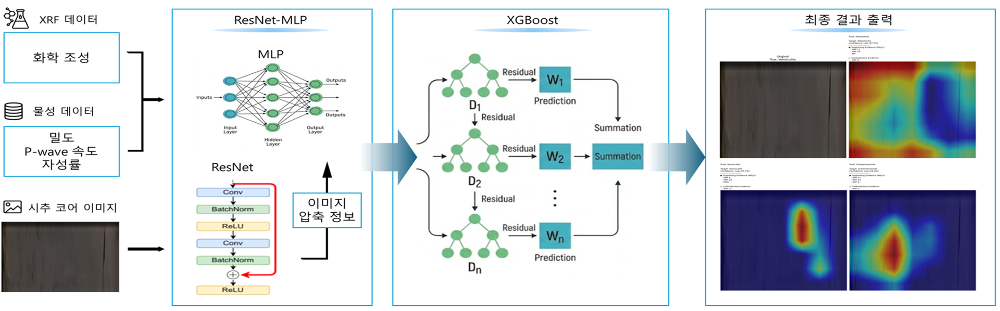
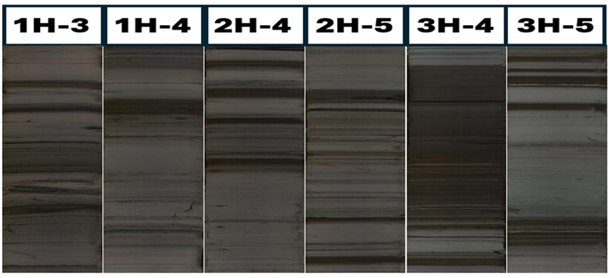
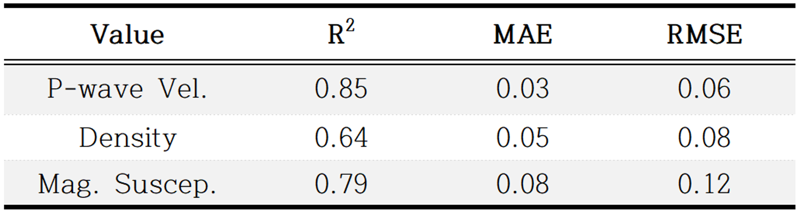
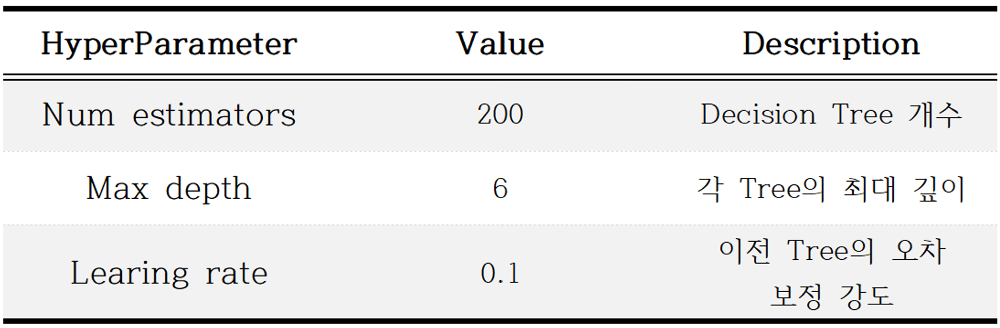
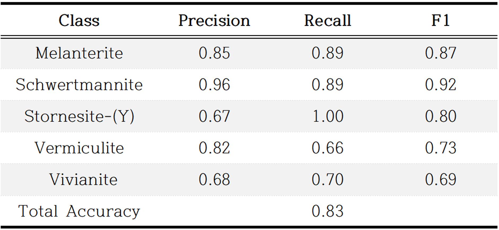
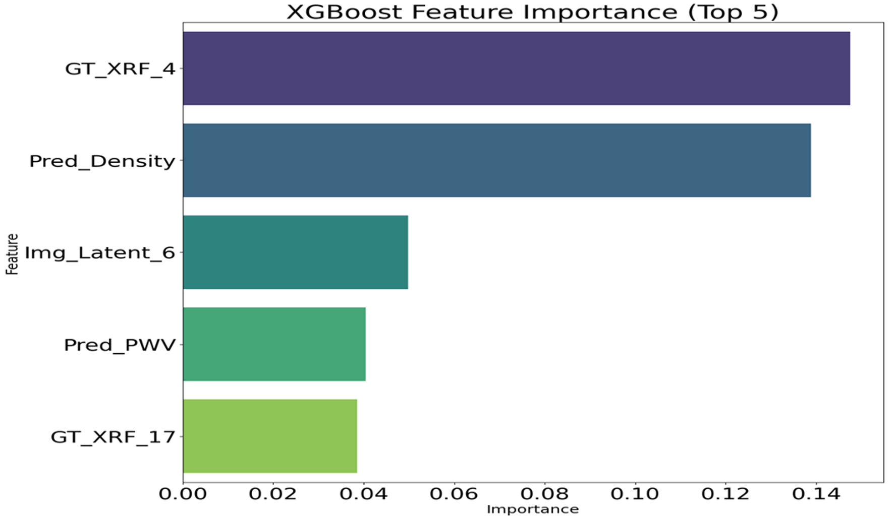
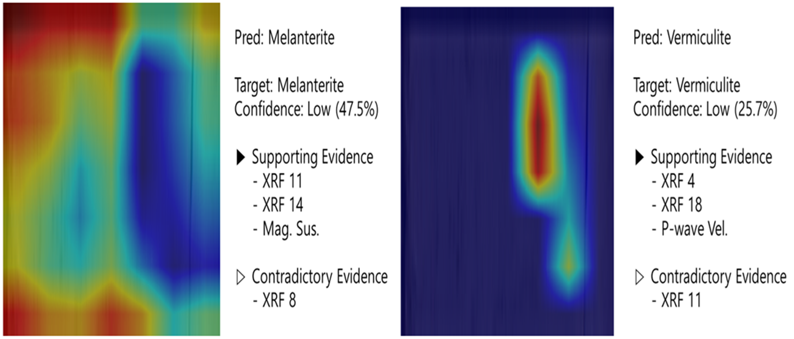

## :link: :1st_place_medal: ASK2026 : Automated Mineral Species Classification of Drill Cores for Efficient Resource Exploration

주제 : 자원탐사 효율화를 위한 시추 코어 광물 종 자동 분류

* **저자 : 정지성, 손형오, 노예진, 최지우, 김재원, 이규원, 김영균**
* **ACK 2026 학술 발표대회 논문집 ppooo-ooo**

[](https://www.python.org/downloads/)
[](https://pytorch.org/)
[](https://xgboost.ai/)
[](https://opensource.org/licenses/MIT)

개요: 본 연구는 시추 코어의 시각 정보와 지화학 성분 정보를 통합하여 물리적 특성을 선제적으로 예측하고, 이를 바탕으로 광물 종을 정밀하게 분류하는 단계적 모델을 제안하였다.

---

## 📝 01. 요약 (Abstract)
> 세계적인 에너지 전환에 따라 전략 광물의 수요가 급증하고 있습니다. 본 연구는 현장에서 즉각적으로 획득 가능한 **XRF 성분 데이터**와 **시각 이미지**를 결합하여, 측정에 많은 비용이 드는 물성 지표(P파 속도, 밀도, 자화율)를 예측하고 최종적으로 광물 종을 자동 분류하는 시스템을 구축하였다. 
* **핵심 성과:** P파 속도 예측 결정계수($R^2$) **0.85** 달성, 광물 분류 정확도 **83%** 확보.
<p align="center">
  
</p>

---

## 📌 02. 데이터셋 (Dataset)
국제 해양 시추 프로그램(IODP) Expedition 346 프로젝트의 동해 Site U1424 지점 데이터를 활용하였습니다.

| 데이터 범주 | 측정 장비 | 주요 특징량 (Features) | 해상도 |
| :--- | :--- | :--- | :--- |
| **Visual** | Section Half Imaging Logger | RGB Image | 200 pixels/cm |
| **Elemental** | AVAATECH XRF Core Scanner | 23종 원소 농도 (Elemental concentrations) | 10 mm |
| **Petrophysical** | Multi-Sensor Core Logger | Density, P-wave velocity, Mag. Susceptibility | 20 mm |
<p align="center">
  
</p>

---

## 📌 03. 데이터 전처리 (Preprocessing)
서로 다른 센서에서 측정된 데이터의 공간 해상도 편차를 해결하기 위해 다음과 같은 과정을 거쳤습니다.

1.  **공간적 위치 통합:** 모든 수치 지표를 2mm 기준 격자로 설정하여 선형보간법(Linear Interpolation) 적용.
2.  **데이터 무결성 확보:** 결측치 필터링 및 Min-Max 정규화(Scaling) 수행.
3.  **데이터 효율화:** 국제광물학회 표준 기반 라벨링 및 **HDF5 형식** 통합 관리.

---

## 📌 04. 물리적 특성 예측 모델 (ResNet-MLP)
1단계 모델은 시각적 특징과 지화학 성분을 통합하여 물리적 특성을 예측합니다.

* **구조:** ResNet-18(이미지 인코더) + MLP(XRF 데이터 처리).
* **핵심 수식:** 지화학 성분 기반 예측값에 시각적 잔차 보정량을 더해 정확도를 높입니다.

$$y = MLP(x_{xrf}) + w \cdot ResNet(x_{img})$$
<p align="center">
  
</p>

---

## 📌 05. 광물 종 분류 모델 (XGBoost)
2단계에서는 1단계에서 예측된 물성값과 원천 데이터를 결합하여 최종 분류를 수행합니다.

* **모델:** XGBoost (Extreme Gradient Boosting).
* **장점:** 클래스 불균형 문제를 효과적으로 해결하며 희귀 광물 종 식별 성능이 뛰어남.
* **주요 하이퍼파라미터:**
    * `num_estimators`: 200
    * `max_depth`: 6
    * `learning_rate`: 0.1
<p align="center">
  
</p>

---

<p align="center">
  
</p>

---

## 📝 06. 결론 (Conclusion)
실험 결과, 제안된 통합 모델은 단일 데이터를 활용한 기존 방식보다 우수한 성능을 보였습니다.

* **물성 예측 성능:** P-wave $R^2$ **0.85**, Mag. Suscep. $R^2$ **0.79** 기록.
* **설명 가능성 (XAI):** **Grad-CAM**을 통한 이미지 분석 근거 가시화 및 **SHAP**을 활용한 변수 기여도 산출로 모델의 신뢰성을 확보하였습니다.
<p align="center">
  
</p>

---

<p align="center">
  
</p>

---

## 🔍 07. 향후 연구 (Future Work)
* **범용성 확장:** 특정 탐사 지역 외의 다양한 지질 데이터 확충을 통한 모델 일반화.
* **데이터 보강:** 샘플 수가 부족한 희귀 광종에 대한 데이터 증강 연구 수행.

---

## 📄 08. 참고문헌 (References)
* [1] IEA, *The Role of Critical Minerals in Clean Energy Transitions*, 2021.
* [2] M. Damaschke, et al., "Unlocking national treasures: the core scanning approach," *Geol. Soc. Lond. Spec. Publ.*, 2023.
* [3] F. Alzubaidi, et al., "Automated lithology classification from drill core images using CNNs," *J. Pet. Sci. Eng.*, 2021.
* [4] C. Günther, et al., "Machine learning for drill core image analysis: A review," *Ore Geol. Rev.*, 2025.
* [5] I. C. Contreras Acosta, et al., "A Machine Learning Framework for Drill-Core Mineral Mapping," *IEEE JSTARS*, 2019.
* [6] P. Blum, *Physical properties handbook: a guide to the shipboard measurement of physical properties*, ODP Tech. Note, 1997.
* [7] R. Tada, et al., "Site U1424," *Proc. IODP*, 2015.
* [8] I. W. Croudace & R. G. Rothwell (Eds.), *Micro-XRF Studies of Sediment Cores*, Springer, 2015.
* [9] K. He, et al., "Deep Residual Learning for Image Recognition," *CVPR*, 2016.
* [10] T. Chen & C. Guestrin, "XGBoost: A Scalable Tree Boosting System," *KDD*, 2016.
* [11] J. L. Davalos-Monteiro, et al., "AI-Based Prediction of Rock Mechanical Properties," *IPTC*, 2026.
* [12] S. Lundberg & S. Lee, "A Unified Approach to Interpreting Model Predictions," *NIPS*, 2017.

---

## 🧑‍💻 Citation

```bibtex
@article{jung2026automated,
  title={Automated Mineral Species Classification of Drill Cores for Efficient Resource Exploration},
  author={Jisung Jung, Hyoengoh Son, Yejin Noh, Jiwoo Choi, Jaewon Kim, Gyuwon Lee, Younggyun Kim},
  journal={Academic Research Project},
  year={2026}
}
